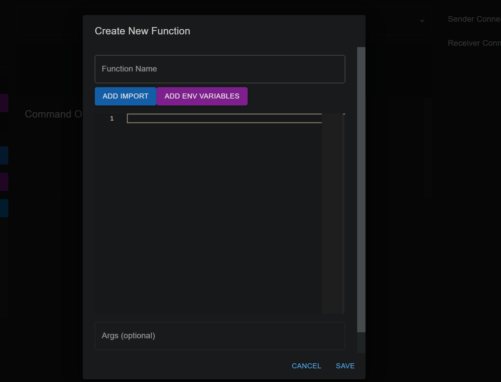
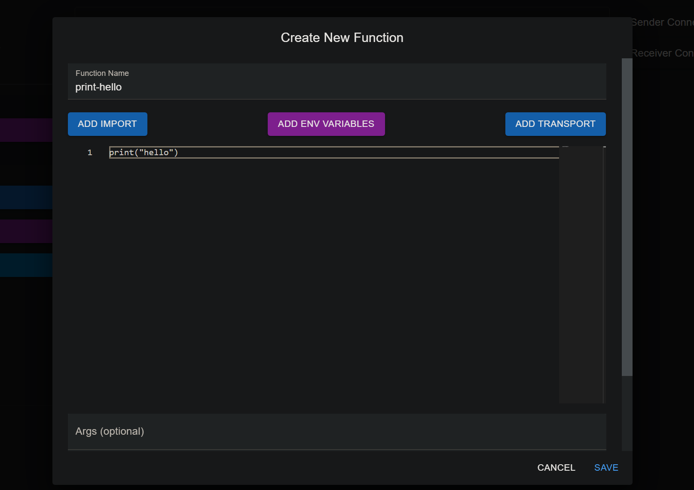
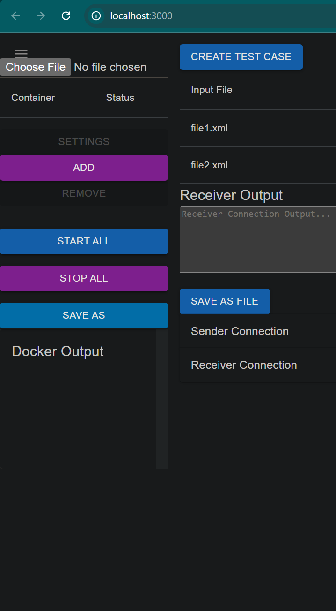

# GPT Pair Programming Notes

## Model

[GPT-4o](https://help.openai.com/en/articles/7102672-how-can-i-access-gpt-4-gpt-4-turbo-gpt-4o-and-gpt-4o-mini)

## General

- Break up work into small or medium sized tasks.
- Large tasks ok if wanting to cover a lot of ground to start off, just be prepared for bugs.
- Find sweet spot between providing just enough context (copy/paste code, intructions, etc.) but not too much context.
- Copy/pasting code directly from GPT can get sussy because it might start dropping little details in the original code. ~~Yelling at it~~ being more specific and verbally stricter with requests helps prevent this.
- Compared to manually writing the code; it's way, way slower. Even if someone had a dev environment with a bunch of fancy macros and maybe some autocomplete like Github Copilot, getting ChatGPT to write verbose code is definitely faster overall, which is sometimes a little sad.
  - Knowing this, I'm trying to delegate manual code changes to tiny adjustments or when ChatGPT can't get itself out of a bug. Manual code adjustments are my last resort to prioritize dev speed.
  - I tried to manually whip up some React code for a non-complex feature and it took **WAY** longer than getting some generated crap from ChatGPT and touching it up (if necessary)
- **The best pair programming experience** seems to be when mentally, you just stop trying to solve low-level problems. Need to get into a mindset of "I'm not going to solve this lower-level task. Could I? Sure. Is it a good use of my time/does it provide a good learning experience? No. Then use AI." AI is the grunt, the code slave. Keep leaning on it to get familiar with its limits.
  - This is effective when trying to allocate mental energy/resources carefully. If you expend mental energy solving 'low/micro level' technical problems, that takes away from energy that could be used to think about 'high/macro level'.
  - It's super super tempting to fall into a mindset of "oh I can just code this little part myself", especially when adjusting to tool usage. BUT NO. it's a trap.
    - Instead of thinking 'I can code this or have an idea to solve this', just think about how to verbally capture the problem, the necessary pieces, and tell ChatGPT about it. See what it comes up with for a solution, it could surprise you. If the solution it comes up with is inferior to your own idea, just convey that in the chat so it can readjust its approach.
  - My experience is that AI tools can be used to solve another layer of coding problems we don't solve efficiently with manual labor, just like frameworks and programming languages, etc. have done for us. This can efficiently, but it needs to be done in an engaged, conscious way. You still need to be aware of the problems you're trying to solve even if you aren't intimately familiar with the AI-generated code base.

## Visual

### FunctionEditor visual improvements

I sent screenshots of the `FunctionEditor.tsx` component to ChatGPT, along with the src code of that component and it sent me back code with some visual improvements:

- **Before:**
  
- **After:**
  

It could still be better but it's pretty cool that it knew to:

- add label on Textfield
- make the box wider for coding purposes
- space the buttons evenly.

**I only asked it to 'make this look better'.**

### Layout half-win

This is a good example of when manual dev work is required.
Described the goal of the application and asked for suggestions via screenshots.
It was useful that gpt utilized Drawers to make my single-page layout less clunky.

But, it was unable to fix this little visual hiccup w/ the collapse icon after being asked repeatedly:

- **Expanded Left Drawer:**
  
- **Collapsed Left Drawer:**
  
