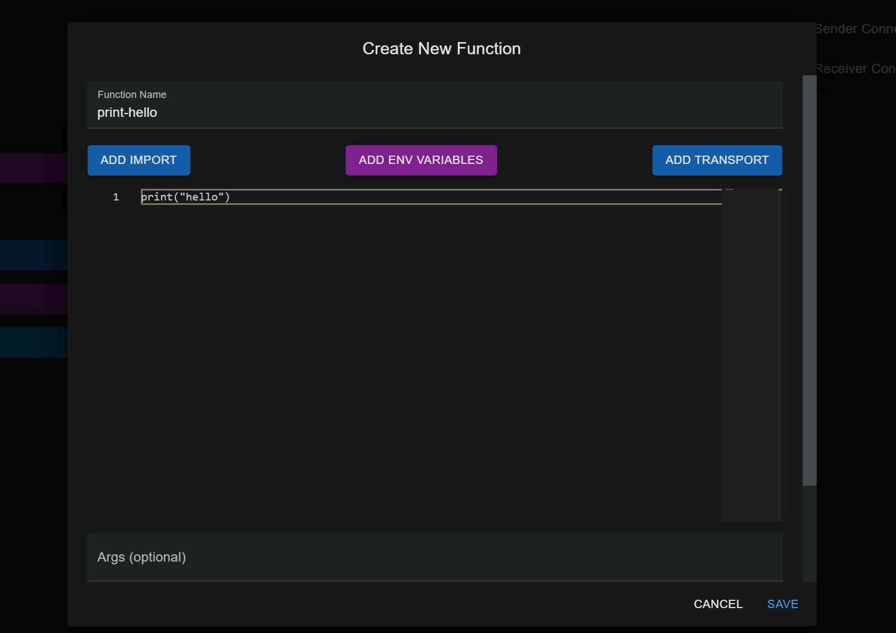

# GPT Pair Programming Notes

## Model

[GPT-4o](https://help.openai.com/en/articles/7102672-how-can-i-access-gpt-4-gpt-4-turbo-gpt-4o-and-gpt-4o-mini)

## General

- Break up work into small or medium sized tasks.
- Large tasks ok if wanting to cover a lot of ground to start off, just be prepared for bugs.
- Find sweet spot between providing just enough context (copy/paste code, intructions, etc.) but not too much context.
- Copy/pasting code directly from GPT can get sussy because it might start dropping little details in the original code. ~~Yelling at it~~ being more specific and verbally stricter with requests helps prevent this.
- Compared to manually writing the code; it's way, way slower. Even if someone had a dev environment with a bunch of fancy macros and maybe some autocomplete like Github Copilot, getting ChatGPT to write verbose code is definitely faster overall, which is sometimes a little sad.
  - Knowing this, I'm trying to delegate manual code changes to tiny adjustments or when ChatGPT can't get itself out of a bug. Manual code adjustments are my last resort to prioritize dev speed.

## Visual

### FunctionEditor visual improvements

I sent screenshots of the `FunctionEditor.tsx` component to ChatGPT, along with the src code of that component and it sent me back code with some visual improvements:

- **Before:**
  
- **After:**
  

It could still be better but it's pretty cool that it knew to:

- add label on Textfield
- make the box wider for coding purposes
- space the buttons evenly.

**I only asked it to 'make this look better'.**

### Layout half-win

This is a good example of when manual dev work is required.
Described the goal of the application and asked for suggestions via screenshots.
It was useful that gpt utilized Drawers to make my single-page layout less clunky.

But, it was unable to fix this little visual hiccup w/ the collapse icon after being asked repeatedly:

- **Expanded Left Drawer:**
  
- **Collapsed Left Drawer:**
  
