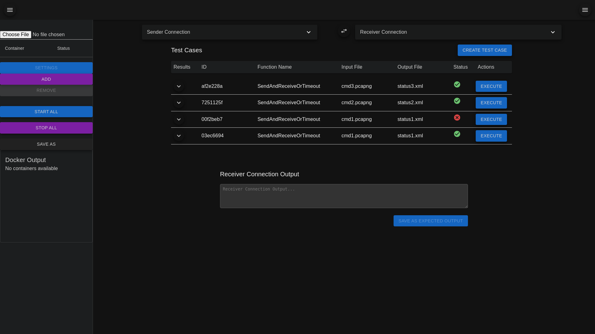

# dynamic-integration-tester

## Usage

1. In `ui/` do:

   - `npm i`
   - `npm start`

2. In `backend/` do:
   - `pip install -r requirements.txt`
   - `python main.py`

### Dependencies

- [Python](https://www.python.org/downloads): `3.12.5`
- [Node](https://nodejs.org/en/download/): `v20.16.0`

## Visual Status

### Puppeteer Screenshot

This project uses Github Actions and [Puppeteer](https://pptr.dev/) so that every push to Github will result in `./ui/screenshot.png` getting regenerated from the latest build.

## TODO List

- [✅] **Create Checklist**

  - Add a checklist to this `README.md` to track TODOs (✅ done!).

- [ ] **Fix Edit Functions and Add Edit Test Case**

  - Fix the 'edit' feature for functions; currently, it only opens a new function creator.
  - Add edit button for Test Case inside the DataGrid. Popup should open with current values
    - rename CreateTestCasePopup to more generic to be inclusive of both editing and creating
    - have this component take in button name and curr ID of the TestCase being edited or null

- [✅] **Default Functions**

  - Implement default functions for TCP and Kafka send/receive. Ensure scripts can manage connection settings.

- [✅] **File Import**

  - Add a file import feature to the connection settings.

- [ ] **Send-Only Mode**

  - Add a 'send-only' mode, enabling users to send data without receiving. Implement this and test case serialization before focusing on test case/assertion features.

- [ ] **Docker Refactor**

  - Refactor Docker integration:
    - Fix file loading and 'start all' functionality.
    - Save loaded files to the backend for persistence.
    - Investigate a library to translate compose data, potentially compatible with TypeScript.

- [✅] **UI Improvements**

  - Optimize the connection settings UI (e.g., use accordions to save space).
  - Further streamline `App.tsx` for simplicity.

- [✅] **Function Editor Enhancements**

  - Add custom arguments to the function editor, with a default argument for the script directory.
    - Create companion JSON files to store these arguments.

- [✅] **Startup Requests**

  - Implement a startup request to the backend to retrieve existing scripts.
    ~~Ensure the UI prevents users from creating duplicate functions/scripts.~~

- [ ] **User defined fn delete**

  - User should be able to delete any function and the companion JSON files in scripts/user_defined, via the UI

- [ ] **Terminology Decision**

  - Decide whether to use "script" or "function" as the standard term.

- [✅] **Test Execution**

  - Build out the pass/fail mechanism for test execution.
  - Save test execution data as JSON and send it to the backend.
  - Query the backend for test cases and display them in a table with status indicators (e.g., grey `-` for unrun tests).

- [ ] **Custom Script Template**

  - The backend is running the .py scripts for test execution as subprocesses. Because of this, we don't have a clean way to get like a 'result' JSON from user/predefined processes.
    - The workaround right now is to use some markers and pattern matching but this will not be user-friendly in the future.
    - If test scripts had a template pattern to follow, could ditch the subprocess thing and make the backend just run the script, if it has a pre-defined template method that expects 'black box' test args
  - The template should pre-populate on the FunctionEditor when a user is creating a new script

- [✅] **Project Management**

  - Persist project data on the backend and query it upon startup.
  - Create a `<Startup>` component for initializing this data.

- [✅] **Code Editor Enhancements**

  - Add draggable imports and draggable buttons to the code editor for:
    - Retrieving environment variables.
    - Accessing transport tools.
    - Specifying the file path for output.

- [ ] **Add Clear Button to Code Editor**

  - Replace import button with 'clear' button for the editor
  - Fix some of the imported code statements - chatgpt might have done some weird stuff there

- [❌] **Address package deprecation warnings**

  - ~~Update `package.json` and review all dependencies for necessary updates.~~
    - prob not worth it; tried doing `npm audit fix --force` and it broke my app

- [ ] **Add backend startup to GitHub Action**

  - Integrate the backend startup process for the Puppeteer automation.

- [✅] **Resolve styling warnings/errors in console**

  - Address issues preventing React v18 from being fully utilized.

- [✅] **Automate Puppeteer screenshot uploads**

  - Implement functionality to auto-upload current screenshots using Puppeteer.

- [ ] **Refactor function_controller/service**

  - Split into `storage_` and `execution_` classes to improve clarity.
  - Remove dead code accumulating in the current structure.

- [✅] **Serialize test results**

  - Implement serialization of test results on the backend.

- [✅] **Query existing serialized results on startup**

  - Create `TestCase` and `TestResult` objects from the backend response to update the state.

- [✅] **Dropdown for fn showing duplicates for scripts**

  - ~~Investigate why the dropdown is showing duplicate scripts; not sure when this started happening.~~
  - Apparently React.StrictMode causes all components to mount twice. Kinda seems yucky. Rm'd.

- [✅] **Backend to parse the result status into a failure msg**

  - Implement backend logic to parse result status and generate a failure message.

- [✅] **Receiver output to make it to receiver output window**

  - Ensure receiver output is correctly displayed in the receiver output window.

- [ ] **Nest TableContainers in DataGrid Rows for TestCases Display**

  - Each TestResult is tied to a TestCase ID but also has its own unique ID. Instead of showing every TestResult in the DataGrid, each row should show the latest test result and then a toggle to open a table underneath the row to show past TestResults (sorted from newest to old).

- [ ] **Fn-selection added to Create Test Case logic**

  - Consider adding fn-selection to the Create Test Case logic.
  - Idea: Implement a button in the DataGrid that opens the Function drawer with the selected function.
  - Ensure users can't accidentally override pre-defined scripts; consider always saving as new.
  - Check for duplicate names on the front end by querying all functions from the backend.
