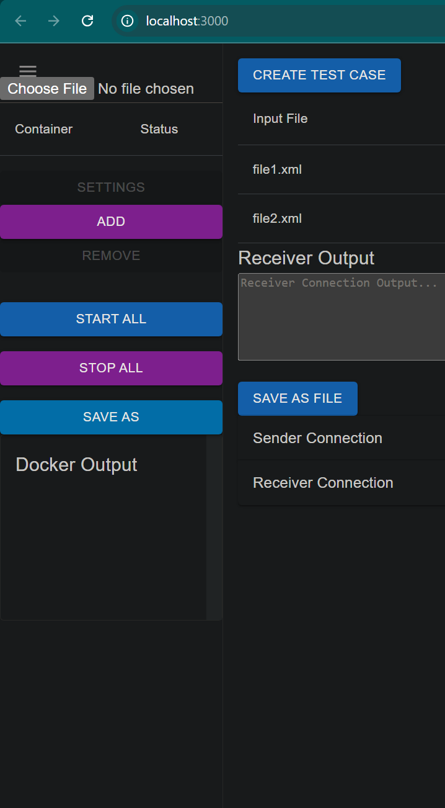

# dynamic-integration-tester

## Usage

1. In `ui/` do:

   - `npm i`
   - `npm start`

2. In `backend/` do:
   - `pip install -r requirements.txt`
   - `python main.py`

### Dependencies

- [Python](https://www.python.org/downloads): `3.12.5`
- [Node](https://nodejs.org/en/download/): `v20.16.0`

## Fun ChatGPT Findings

### FunctionEditor visual improvements

I sent screenshots of the `FunctionEditor.tsx` component to ChatGPT, along with the src code of that component and it sent me back code with some visual improvements:

- **Before:**
  
- **After:**
  

It could still be better but it's pretty cool that it knew to:

- add label on Textfield
- make the box wider for coding purposes
- space the buttons evenly.

**I only asked it to 'make this look better'.**

### Layout half-win

This is a good example of when manual dev work is required. 
Described the goal of the application and asked for suggestions via screenshots.
It was useful that gpt utilized Drawers to make my single-page layout less clunky.

But, it was unable to fix this little visual hiccup w/ the collapse icon after being asked repeatedly:

- **Expanded Left Drawer:**
  
- **Collapsed Left Drawer:**
  

## TODO List

- [✅] **Create Checklist**

  - Add a checklist to this `README.md` to track TODOs (✅ done!).

- [ ] **Fix/Edit Feature**

  - Fix the 'edit' feature for functions; currently, it only opens a new function creator.

- [ ] **Default Functions**

  - Implement default functions for TCP and Kafka send/receive. Ensure scripts can manage connection settings.

- [✅] **File Import**

  - Add a file import feature to the connection settings.

- [ ] **Send-Only Mode**

  - Add a 'send-only' mode, enabling users to send data without receiving. Implement this and test case serialization before focusing on test case/assertion features.

- [ ] **Docker Refactor**

  - Refactor Docker integration:
    - Fix file loading and 'start all' functionality.
    - Save loaded files to the backend for persistence.
    - Investigate a library to translate compose data, potentially compatible with TypeScript.

- [✅] **UI Improvements**

  - Optimize the connection settings UI (e.g., use accordions to save space).
  - Further streamline `App.tsx` for simplicity.

- [✅] **Function Editor Enhancements**

  - Add custom arguments to the function editor, with a default argument for the script directory.
    - Create companion JSON files to store these arguments.

- [✅] **Startup Requests**

  - Implement a startup request to the backend to retrieve existing scripts.
    ~~Ensure the UI prevents users from creating duplicate functions/scripts.~~

- [ ] **User defined fn delete**

  - User should be able to delete any function and the companion JSON files in scripts/user_defined, via the UI

- [ ] **Terminology Decision**

  - Decide whether to use "script" or "function" as the standard term.

- [ ] **Test Execution**

  - Build out the pass/fail mechanism for test execution.
  - Save test execution data as JSON and send it to the backend.
  - Query the backend for test cases and display them in a table with status indicators (e.g., grey `-` for unrun tests).

- [✅] **Project Management**

  - Persist project data on the backend and query it upon startup.
  - Create a `<Startup>` component for initializing this data.

- [✅] **Code Editor Enhancements**

  - Add draggable imports and draggable buttons to the code editor for:
    - Retrieving environment variables.
    - Accessing transport tools.
    - Specifying the file path for output.

- [ ] **Add Clear Button to Code Editor**

  - Replace import button with 'clear' button for the editor
  - Fix some of the imported code statements - chatgpt might have done some weird stuff there

- [ ] **Address package deprecation warnings**

  - Update `package.json` and review all dependencies for necessary updates.

- [ ] **Add backend startup to GitHub Action**

  - Integrate the backend startup process for the Puppeteer automation.

- [ ] **Resolve styling warnings/errors in console**

  - Address issues preventing React v18 from being fully utilized.

- [✅] **Automate Puppeteer screenshot uploads**

  - Implement functionality to auto-upload current screenshots using Puppeteer.

- [ ] **Refactor function_controller/service**
  - Split into `storage_` and `execution_` classes to improve clarity.
  - Remove dead code accumulating in the current structure.

- [ ] **Serialize test results**
  - Implement serialization of test results on the backend.
  
- [ ] **Query existing serialized results on startup**
  - Create `TestCase` and `TestResult` objects from the backend response to update the state.